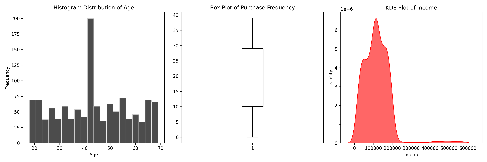
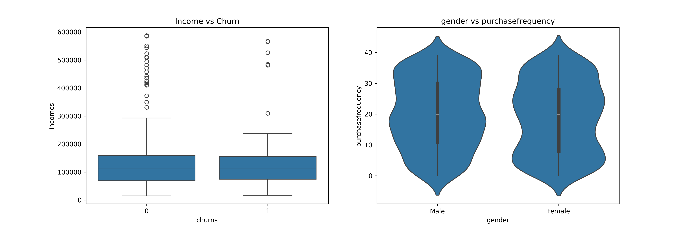
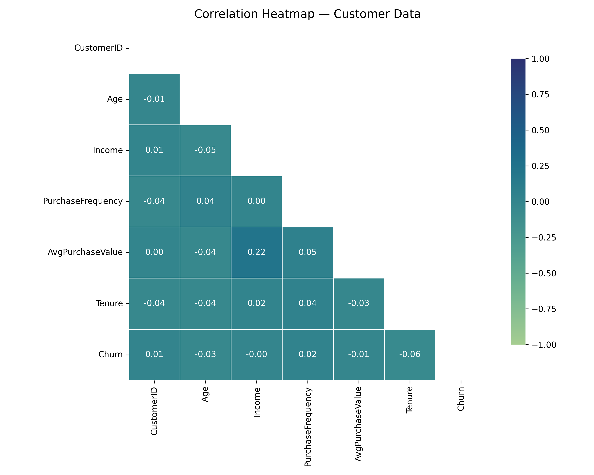
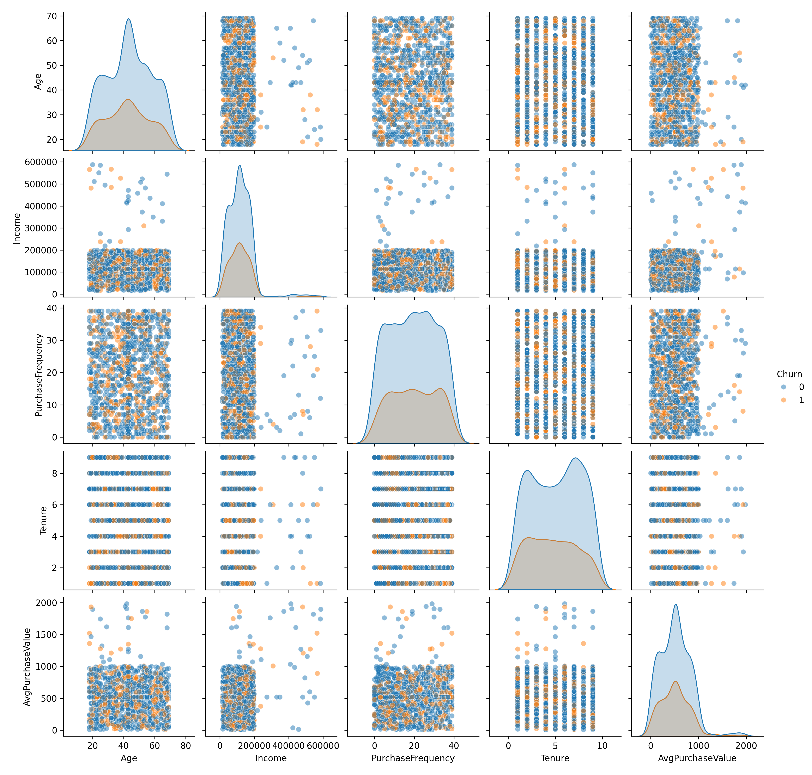

# 📊 Customer Churn Prediction using Data Analysis & Machine Learning

---

## 🚀 Part 1: Project Overview
This project analyzes customer purchase behavior and predicts whether a customer will churn using Machine Learning techniques.

It uses real-world style data containing missing values, outliers, and multiple features to simulate practical scenarios.

---

## 🎯 Part 2: Problem Statement
The objective is to predict whether a customer will churn (1) or not churn (0) based on:

- Purchase behavior  
- Demographic features  

This helps businesses improve customer retention.

---

## 📂 Part 3: Dataset Description

| Feature | Description |
|--------|------------|
| CustomerID | Unique ID |
| Age | Customer age |
| Gender | Male/Female |
| Income | Annual income |
| PurchaseFrequency | Number of purchases |
| AvgPurchaseValue | Spending behavior |
| Tenure | Relationship duration |
| Churn | Target (0/1) |

---

## 🧠 Part 4: Project Workflow

1. Data Acquisition  
2. Data Cleaning  
3. Exploratory Data Analysis (EDA)  
4. Data Profiling  
5. Machine Learning  

---

## 📊 Part 5: Exploratory Data Analysis

### 🔹 Univariate Analysis


---

### 🔹 Bivariate Analysis


---

### 🔹 Multivariate Analysis (Heatmap)


---

### 🔹 Pairplot Analysis


---

## 🖼️ Part 6: Images Folder Structure
images/
│── univariate_analysis.png
│── bivariate_analysis.png
│── multivariate_analysis.png
│── pairplot.png

---

## 🤖 Part 7: Machine Learning Model

- Algorithm: Logistic Regression  
- Type: Binary Classification  
- Target: Churn  

---

## 📈 Part 8: Key Insights

- Customers with low purchase frequency are more likely to churn  
- Income influences spending behavior  
- Outliers are present in dataset  
- Tenure affects retention  

---

## 🛠️ Part 9: Technologies Used

- Python  
- Pandas  
- NumPy  
- Matplotlib  
- Seaborn  
- Scikit-learn  
- ydata-profiling  

---

## 📁 Part 10: Project Structure
├── images/
├── advanced_customer_data.csv
├── advanced_customer_data.json
├── advanced_customer_data.db
├── full_project_notebook.ipynb
├── Part_A_Answers.pdf
├── quick_report.html
├── README.md


---

## ▶️ Part 11: How to Run

```bash
git clone <your-repo-link>
cd your-project
pip install pandas numpy matplotlib seaborn scikit-learn ydata-profiling
jupyter notebook full_project_notebook.ipynb